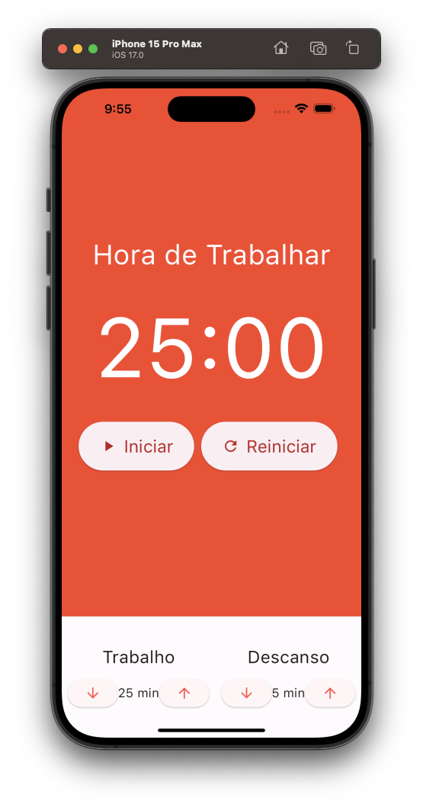

---

## Pomodoro App (Em Progresso)

---

<div align="center">

**Language:**

[](README.md)

</div>

---
## ℹ️ Sobre este repositório
Aplicativo mobile para execução da técnica pomoro.

O objetivo principal deste repositório é demonstrar o aplicativo desenvolvido para treinar meus conhecimentos durante o curso de Flutter da empresa [COD3R](https://www.udemy.com/course/curso-flutter/).

Construido utilizando Mobx e Provider.

---
## ⚙️ Funcionalidades
(Em breve)

---
## 👁️ Pré-visualização
<h1 align="center">
    
    
    
    
</h1>

---
## 🧪 Tecnologias
Este projeto foi desenvolvido usando as seguintes tecnologias:

- [Flutter 3.16.8](https://docs.flutter.dev/)
- [Dart 3.2.4](https://dart.dev/)
- [Intl](https://pub.dev/packages/intl)
- [mobx](https://pub.dev/packages/mobx)
- [flutter_mobx](https://pub.dev/packages/flutter_mobx)
- [mobx_codegen](https://pub.dev/packages/mobx_codegen)
- [build_runner](https://pub.dev/packages/build_runner)
- [Provider](https://pub.dev/packages/provider)

---
## ⚡ Instalação

Primeiramente clone este projeto usando:

```bash
  git clone https://github.com/GoedertDalmolin/pomodoro.git
  cd pomodoro
```

Por fim, com o flutter instalado em sua maquina, execute o seguinte comando:

```bash
  flutter run
```

---
</> Desenvolvido por [GoedertDalmolin](https://github.com/GoedertDalmolin) 👋
---