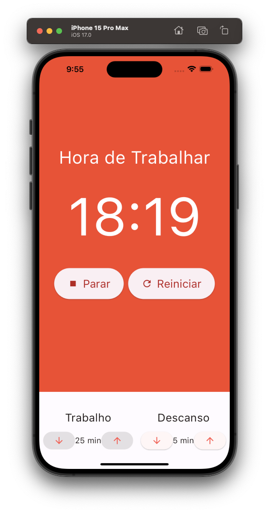
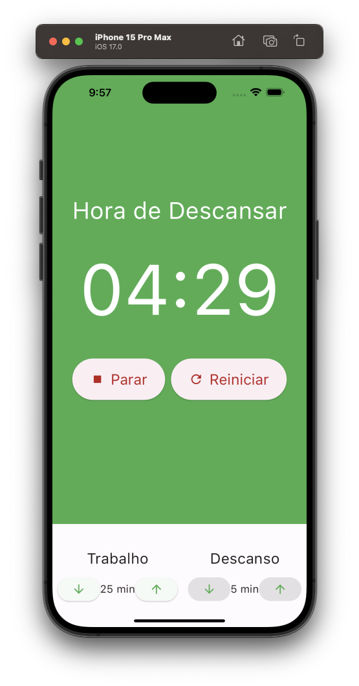

---

## Pomodoro App

---

<div align="center">

**Language:**

[](README.md)
[](README.pt-br.md)

</div>

---
## ℹ️ About this repository
Mobile application for performing the pomodoro technique.

his repository's main objective is to demonstrate the application developed to train my knowledge during the Flutter course from the company [COD3R](https://www.udemy.com/course/curso-flutter/).

Built with Flutter using the Mobx and Provider packages.

---
## ⚙️ Features

- Monitor work pace and focus.
- Monitor rest time after performing a job.
- It is possible to manually configure the work and rest time with the pomodoro running.
- Pause and restart the pomodoro if necessary.

---
## 👁️ Preview
<h1 align="center">
    
    
</h1>
<h1 align="center">
    
    
</h1>

---
## 🧪 Technologies
This project was developed using the following technologies:

- [Flutter 3.16.8](https://docs.flutter.dev/)
- [Dart 3.2.4](https://dart.dev/)
- [Intl](https://pub.dev/packages/intl)
- [mobx](https://pub.dev/packages/mobx)
- [flutter_mobx](https://pub.dev/packages/flutter_mobx)
- [mobx_codegen](https://pub.dev/packages/mobx_codegen)
- [build_runner](https://pub.dev/packages/build_runner)
- [Provider](https://pub.dev/packages/provider)

---
## ⚡ Installation

First clone this project using:

```bash
  git clone https://github.com/GoedertDalmolin/pomodoro.git
  cd pomodoro
```

Finally, with flutter installed on your machine, run the following command:

```bash
  flutter run
```

---
</> Developed by [GoedertDalmolin](https://github.com/GoedertDalmolin) 👋
---